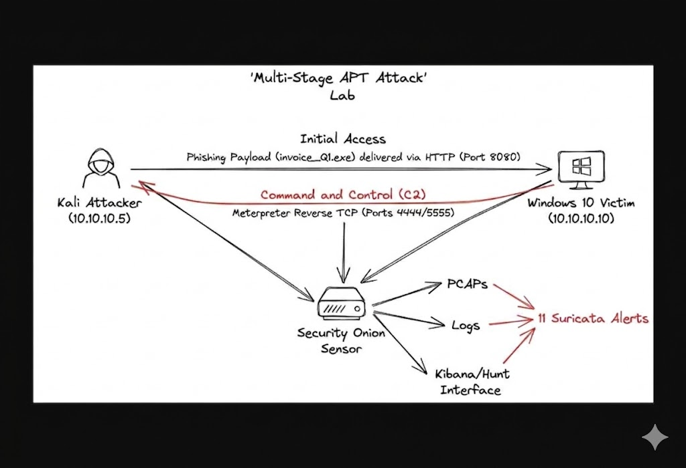
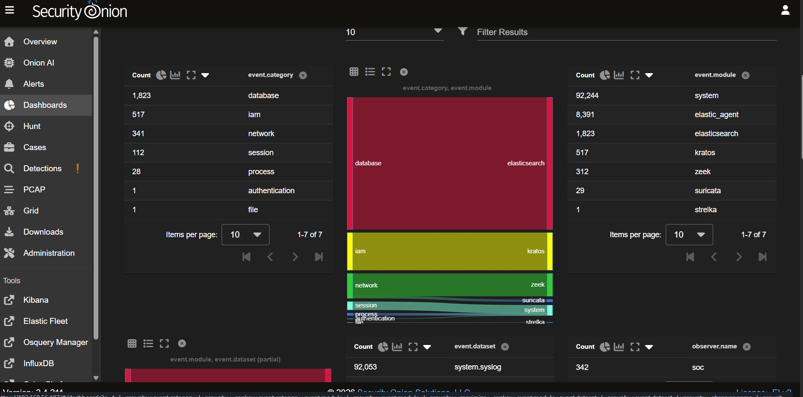
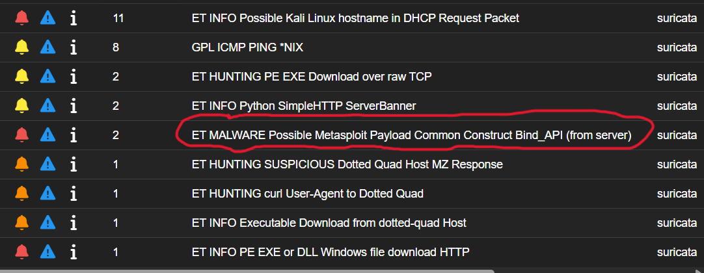
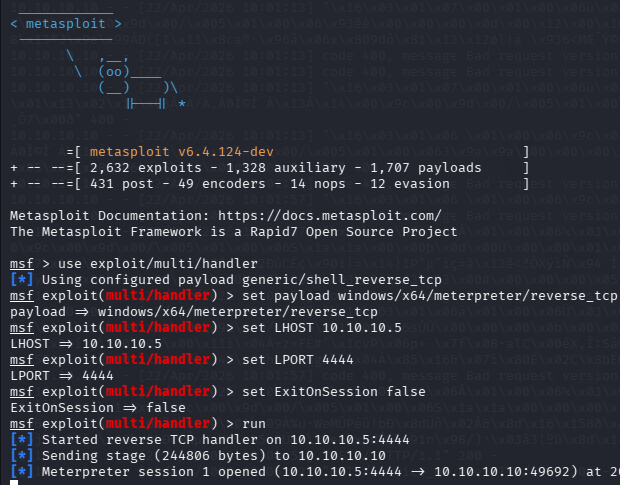
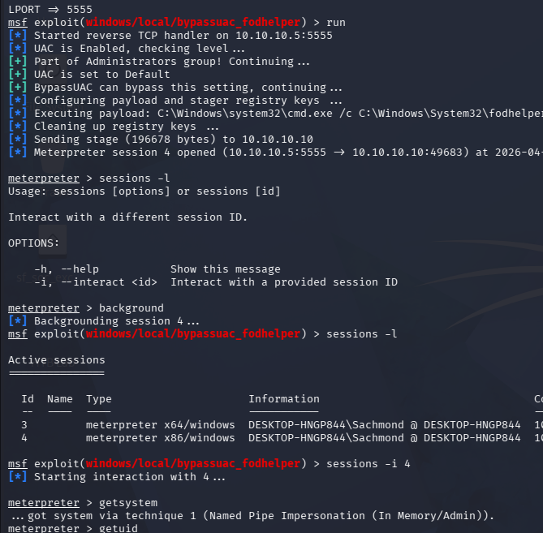
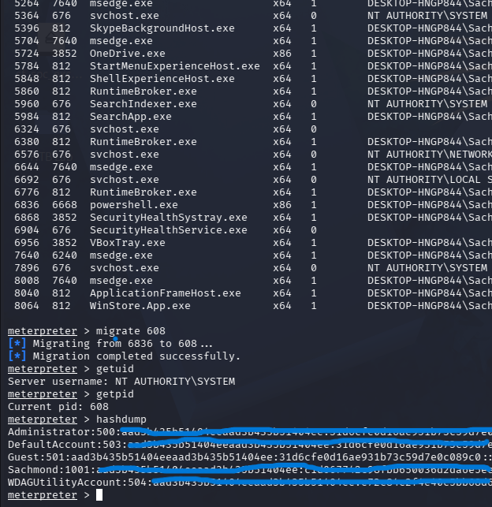
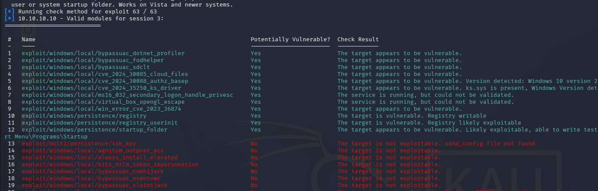
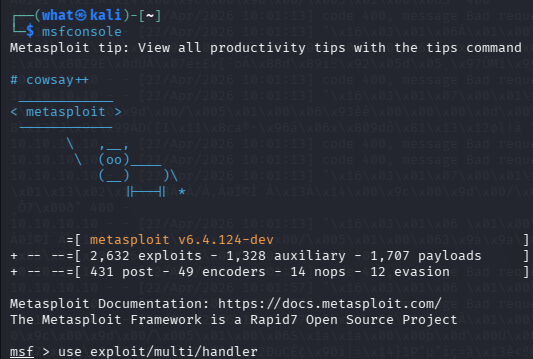
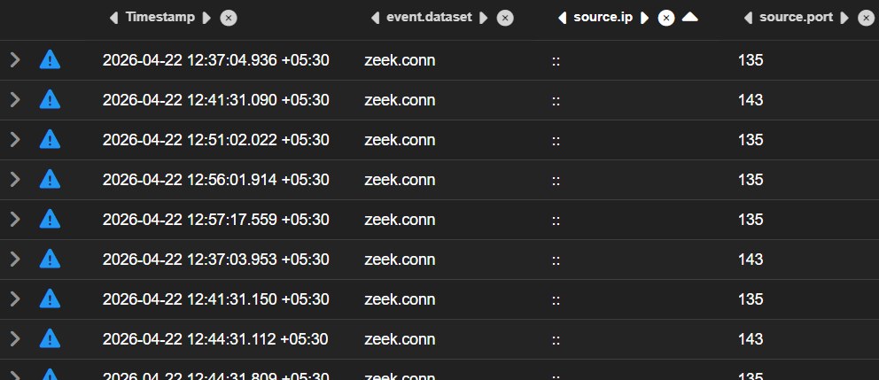
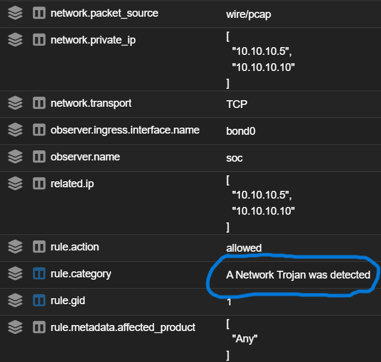

# Multi-Stage APT Attack Detection with Security Onion

"Turning 92,000 raw events into 1 actionable timeline."
This repository documents a full-scale APT simulation and forensic investigation. By leveraging  [Security Onion](https://securityonion.net/), I successfully identified and reconstructed a multi-stage attack lifecycle—from initial phishing delivery and UAC bypass to credential harvesting and data exfiltration—using pure network-layer telemetry.

## 🌐 Lab Topology

A dedicated offensive lab was constructed on a shared virtual network, leveraging Kali Linux for the attack origin and a Windows 10 target. Security Onion was configured as the passive network sensor, monitoring the complete multi-stage traffic flow:

## 🔖 The Investigative Challenge: High-Fidelity Data Correlation

In a modern SOC environment, the challenge isn't lack of data—it's the noise. As shown in the **Security Onion Dashboard** below, the lab environment processed over **92,000 system events** and thousands of network metadata entries during the attack window.

My objective was to filter through this massive telemetry to identify the "Signal in the Noise." By correlating **Suricata NIDS alerts** with **Zeek connection logs**, I successfully isolated the 11 critical stages of the APT lifecycle, transforming thousands of raw data points into a single, actionable forensic timeline.

*Figure 1: Security Onion 'Overview' interface displaying the distribution of event modules (Suricata, Zeek, System) used during the investigation.*

## 🕵️ Executive Summary

This project showcases a comprehensive investigation of a multi-stage Advanced Persistent Threat (APT) attack within a controlled lab environment. Using Security Onion, I successfully monitored and analyzed a complete attack chain—from initial phishing delivery to DNS-based data exfiltration.

## 🔍 Detection Deep Dive: The APT Lifecycle

This investigation tracked the adversary from initial delivery to full domain compromise. Below are the key milestones captured during the analysis:

### Phase 1: Initial Access & Backdoor Establishment
The attack began with a phishing payload. Security Onion's Suricata engine immediately flagged the **Meterpreter Reverse TCP** stager and the initial Trojan activity.
* **Evidence:** NIDS alerts identified the signature of the `invoice_Q1.exe` payload and the subsequent C2 check-in.

### Phase 2: Privilege Escalation & Process Migration
Once a low-privilege shell was established, I then used `bypassuac_fodhelper` to elevate permissions. I monitored the transition from a standard user context to `NT AUTHORITY\SYSTEM`.
* **Detection:** Security Onion captured the process migration into `explorer.exe` to blend in with legitimate system traffic and maintain persistence.

### Phase 3: Technical Analysis of Exploitation
Beyond simple alerts, I analyzed the specific "Ways of Exploit" to understand how the adversary navigated the internal network.

---

## 🛠️ Tools & Techniques

### Offensive (Adversary Emulation)
To simulate a realistic threat, I utilized the **Metasploit Framework** to generate payloads and manage the command-and-control (C2) infrastructure.
* **Meterpreter:** Used for in-memory execution to avoid disk-based detection.

### Defensive (Detection & Analysis)
* **Security Onion 2.4:** The core "Big Data" security platform used for the investigation.
* **Suricata:** Provided signature-based alerts for the Meterpreter stager and Trojan activity.
* **Zeek:** Crucial for protocol metadata analysis, identifying suspicious long-running connections and non-standard port usage.

## 📑 Key Achievement

Correlated 11 unique Suricata alerts to reconstruct a timeline of attacker activity without relying on host-based telemetry, demonstrating the power of network traffic analysis (NTA) in identifying stealthy persistence and credential dumping techniques.

## 🛡️ MITRE ATT&CK Mapping

## Attack Lifecycle (MITRE ATT&CK)

| Tactic                  | Technique                     | Evidence                                      |
|------------------------|-------------------------------|-----------------------------------------------|
| Initial Access         | Phishing (T1566.001)          | invoice_Q1.exe delivered via HTTP             |
| Privilege Escalation   | UAC Bypass (T1548.002)        | bypassuac_fodhelper execution                 |
| Credential Access      | LSASS Dumping (T1003.001)     | Mimikatz/Kiwi hashdump                        |
| Exfiltration           | DNS Tunneling (T1048.003)     | PowerShell Resolve-DnsName patterns           |

## 📖 How to Use This Repo
1. **Explore the Screenshots:** Review the images in the root directory to see the correlation between attacker commands and defender alerts.
2. **Lab Replication:** You can use the provided **Network Diagram** to replicate this setup using VirtualBox which i personally recommend or even Proxmox or VMware.

## 🤝 Let's Connect!
I am an aspiring SOC Analyst / Threat Hunter. If you enjoyed this project or have questions about the detection logic used:
* ⭐ **Star this repo** if you found it useful!
* 👤 **Follow me** here on GitHub for more lab write-ups.
